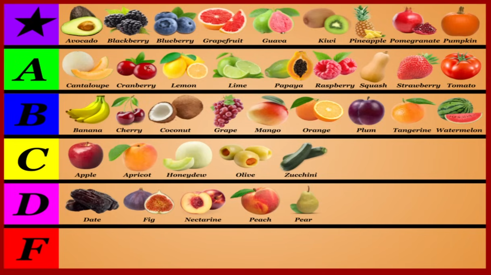

## Wprowadzenie do Tier Listy Owoców

Film omawia wartości odżywcze popularnych owoców, klasyfikując je w tierach od S (najlepsze) do D (nadal dobre, ale mniej imponujące). Podkreślono, że praktycznie wszystkie owoce są zdrowe. Główne cechy owoców to wysoka zawartość błonnika, wody, antyoksydantów i naturalnych cukrów o niższym indeksie glikemicznym.

**Uwaga: Wszystkie wartości odżywcze przedstawionych owoców są wyrażone na 100 gramów produktu. Wartości procentowe dziennego zapotrzebowania dotyczą diety 2000-kalorycznej.**

---

## Tier S (Gwiazdka - Najlepsze z Najlepszych)

### Awokado

*   **Kalorie:** ~160 kcal
*   **Cukry:** ~1g
*   **Błonnik:** ~7g
*   **Główne Mikroelementy:** Witamina K (26%), Kwas foliowy (20%), Witamina C (17%), Witamina B5 (14%), Potas (14%), Witamina B6 (13%), Witamina E (10%)
*   **Zalety:**
    *   Bogate w zdrowe tłuszcze (głównie kwas oleinowy Omega-9), wspierające zdrowie serca, regulujące cholesterol i ciśnienie krwi.
    *   Bardzo wysoka zawartość błonnika, wspierająca uczucie sytości i zdrowie jelit.
    *   Bogactwo witamin i minerałów.
    *   Silne właściwości antyoksydacyjne i przeciwzapalne.
*   **Wady:**
    *   Wysoka kaloryczność ze względu na zawartość tłuszczu (choć są to zdrowe tłuszcze).

### Jeżyna

*   **Kalorie:** ~45 kcal
*   **Cukry:** ~5g
*   **Błonnik:** ~5g
*   **Główne Mikroelementy:** Witamina C (35%), Mangan (32%), Witamina K (25%)
*   **Zalety:**
    *   Jedno z najlepszych źródeł antyoksydantów (witamina C, antocyjany), które zwalczają wolne rodniki i poprawiają zdrowie naczyń krwionośnych.
    *   Wysoka zawartość błonnika wspierająca zdrowie układu pokarmowego.
    *   Dobre źródło manganu i witaminy K.
    *   Wspiera zdrowie mózgu i ma właściwości antybakteryjne.
*   **Wady:**
    *   Brak wyraźnych wad pod kątem wartości odżywczych.

### Borówka amerykańska

*   **Kalorie:** ~55 kcal
*   **Cukry:** ~10g
*   **Błonnik:** ~2g
*   **Główne Mikroelementy:** Witamina K (24%), Mangan (17%), Witamina C (16%)
*   **Zalety:**
    *   Uważane za jedne z najbogatszych w antyoksydanty owoców (kwercetyna, mirycetyna, witamina C, antocyjany).
    *   Wspierają odporność, zdrowie serca, redukują uszkodzenia oksydacyjne DNA i zapobiegają chorobom przewlekłym.
    *   Mogą obniżać poziom cukru i ciśnienie krwi.
    *   Wspierają funkcje poznawcze i mogą skracać czas regeneracji mięśni.
*   **Wady:**
    *   Brak wyraźnych wad pod kątem wartości odżywczych.

### Grejpfrut

*   **Kalorie:** ~40 kcal
*   **Cukry:** ~7g
*   **Błonnik:** ~2g
*   **Główne Mikroelementy:** Witamina C (52%), Witamina A (23%)
*   **Zalety:**
    *   Doskonałe źródło witaminy C (wsparcie odporności) i karotenoidów (witamina A - zdrowie oczu).
    *   Zawiera likopen (zdrowie serca i skóry, działanie przeciwnowotworowe) oraz flawonoidy (działanie przeciwzapalne, regulacja ciśnienia krwi).
    *   Kwas cytrynowy wspomaga wchłanianie składników odżywczych i zapobiega kamieniom nerkowym.
    *   Może poprawiać wrażliwość na insulinę.
*   **Wady:**
    *   **Bardzo ważne:** Może hamować enzymy potrzebne do metabolizowania wielu leków (np. na cholesterol, ciśnienie krwi, rytm serca, infekcje, leki przeciwbólowe, rozrzedzające krew). Zawsze skonsultuj się z lekarzem, jeśli przyjmujesz jakiekolwiek leki.

### Gujawa

*   **Kalorie:** ~70 kcal
*   **Cukry:** ~9g
*   **Błonnik:** ~5g
*   **Główne Mikroelementy:** Witamina C (381%!), Witamina A (12%), Kwas foliowy (12%), Potas (12%)
*   **Zalety:**
    *   Ekstremalnie wysoka zawartość witaminy C, silnego antyoksydanta wspierającego odporność, zdrowie skóry i serca oraz zwalczającego choroby przewlekłe.
    *   Zawiera różnorodne antyoksydanty (kwercetyna, kwas ferulowy, kwas galusowy, kwas kawowy), chroniące przed uszkodzeniem komórek i chorobami przewlekłymi.
    *   Dobre źródło błonnika, wspierającego zdrowie układu pokarmowego poprzez odżywianie dobrych bakterii jelitowych.
    *   Może obniżać poziom cukru we krwi.
*   **Wady:**
    *   Profil odżywczy jest nieco jednostronny (skupiony na witaminie C), ale nadal imponujący.

### Kiwi

*   **Kalorie:** ~60 kcal
*   **Cukry:** ~9g
*   **Błonnik:** ~3g
*   **Główne Mikroelementy:** Witamina C (155%!), Witamina K (50%), Potas (9%)
*   **Zalety:**
    *   Doskonałe źródło witaminy C (wsparcie odporności, zdrowia skóry i serca) oraz witaminy K (krzepnięcie krwi).
    *   Bogate w antyoksydanty (witamina E, karotenoidy, polifenole), chroniące komórki.
    *   Dobre źródło błonnika, wspierającego zdrowie jelit.
    *   Może obniżać ciśnienie krwi.
    *   Wysoka zawartość serotoniny, która reguluje nastrój i sen.
*   **Wady:**
    *   Brak wyraźnych wad pod kątem wartości odżywczych.

### Ananas

*   **Kalorie:** ~50 kcal
*   **Cukry:** ~10g
*   **Błonnik:** ~1g
*   **Główne Mikroelementy:** Witamina C (80%!), Mangan (46%)
*   **Zalety:**
    *   Solidne źródło manganu (ważnego dla formowania kości i metabolizmu).
    *   Bogaty w antyoksydanty (witamina C, flawonoidy, związki fenolowe), które wspierają odporność i zdrowie serca.
    *   Zawiera bromelainę, grupę enzymów wspomagających trawienie, regenerację mięśni po wysiłku, oraz mających działanie przeciwzapalne, przeciwnowotworowe i przeciwartretyczne.
*   **Wady:**
    *   Nadmiar bromelainy może powodować problemy trawienne i negatywnie wpływać na osoby przyjmujące leki rozrzedzające krew.
    *   Niska zawartość błonnika.

### Granat

*   **Kalorie:** ~85 kcal
*   **Cukry:** ~14g
*   **Błonnik:** ~4g
*   **Główne Mikroelementy:** Witamina K (21%), Witamina C (17%), Kwas foliowy (10%)
*   **Zalety:**
    *   Dobre źródło witaminy K.
    *   Bogactwo antyoksydantów: punikalaginy (silne działanie przeciwzapalne), polifenole (obniżają ciśnienie krwi, zwalczają blaszki miażdżycowe w tętnicach), witamina C (wsparcie odporności) oraz elagitaniny (wsparcie zdrowia mózgu, zapobieganie chorobie Alzheimera i Parkinsona).
    *   Właściwości antybakteryjne, korzystne dla bakterii jelitowych, działanie przeciwnowotworowe i redukcja ryzyka kamieni nerkowych.
*   **Wady:**
    *   Stosunkowo wysoka zawartość cukru.

### Dynia

*   **Kalorie:** ~25 kcal
*   **Cukry:** ~3g
*   **Błonnik:** ~3g
*   **Główne Mikroelementy:** Witamina A (z karotenoidów, 311%!), Witamina K (20%)
*   **Zalety:**
    *   Ekstremalnie bogata w karotenoidy (beta-karoten, alfa-karoten, beta-kryptoksantyna, luteina, zeaksantyna), które wspierają zdrowie oczu, kości, odporność i skóry.
    *   Dobre źródło witaminy K.
    *   Wspiera zdrowie serca, układu pokarmowego i odporność.
    *   Chroni przed uszkodzeniami słonecznymi i rozpadem białek.
    *   Zawiera cytrulinę, aminokwas poprawiający wydolność sportową.
*   **Wady:**
    *   Brak wyraźnych wad pod kątem wartości odżywczych.

---

## Tier A (Bardzo Dobre Owoce)

### Melon kantalupa

*   **Kalorie:** ~35 kcal
*   **Cukry:** ~7g
*   **Błonnik:** ~1g
*   **Główne Mikroelementy:** Witamina A (z karotenoidów, 68%), Witamina C (61%), Potas (8%)
*   **Zalety:**
    *   Bardzo bogaty w karotenoidy (beta-karoten, luteina, zeaksantyna, beta-kryptoksantyna), które przekształcają się w witaminę A i wspierają zdrowie oczu.
    *   Wysoka zawartość witaminy C, działającej jako silny antyoksydant i wspierającej odporność, zdrowie serca i skóry.
    *   Może obniżać ciśnienie krwi i ryzyko chorób serca.
*   **Wady:**
    *   Stosunkowo niska zawartość błonnika.

### Żurawina

*   **Kalorie:** ~45 kcal
*   **Cukry:** ~4g
*   **Błonnik:** ~5g
*   **Główne Mikroelementy:** Witamina C (22%), Mangan (18%)
*   **Zalety:**
    *   Dobre źródło błonnika (głównie nierozpuszczalnego), wspierającego trawienie.
    *   Bogata w antyoksydanty (witamina C, kwercetyna, mirycetyna, peonidyna, kwas ursolowy), które mają działanie przeciwzapalne i redukują ryzyko chorób przewlekłych.
    *   Zawiera proantocyjanidyny, które pomagają zwalczać infekcje dróg moczowych (UTI) i mogą zapobiegać niektórym rodzajom raka żołądka poprzez eliminację szkodliwych bakterii.
*   **Wady:**
    *   Może zawierać większe ilości szczawianów, co u niektórych osób może przyczyniać się do powstawania kamieni nerkowych.

### Cytryna

*   **Kalorie:** ~30 kcal
*   **Cukry:** ~3g
*   **Błonnik:** ~3g
*   **Główne Mikroelementy:** Witamina C (88%!)
*   **Zalety:**
    *   Głównie znana z bardzo wysokiej zawartości witaminy C.
    *   Zawiera inne antyoksydanty: diosminę i hesperydynę (poprawa zdrowia naczyń krwionośnych), limonen (działanie przeciwzapalne, antybakteryjne, gojące rany) oraz flawonoidy (działanie przeciwzapalne).
    *   Kwas cytrynowy wspomaga wchłanianie żelaza i zapobiega kamieniom nerkowym.
*   **Wady:**
    *   Nadmiar kwasu cytrynowego może prowadzić do próchnicy zębów i podrażnień.

### Limonka

*   **Kalorie:** ~30 kcal
*   **Cukry:** ~2g
*   **Błonnik:** ~3g
*   **Główne Mikroelementy:** Witamina C (48%)
*   **Zalety:**
    *   Bardzo podobna do cytryny pod względem korzyści.
    *   Dobre źródło antyoksydantu - witaminy C.
    *   Zawiera inne antyoksydanty: limonen, kemferol i kwercetynę, które pomagają zapobiegać uszkodzeniom komórek, stanom zapalnym i chorobom przewlekłym.
    *   Kwas cytrynowy wspomaga wchłanianie żelaza i zapobiega kamieniom nerkowym.
*   **Wady:**
    *   Podobnie jak cytryna, nadmiar kwasu cytrynowego może prowadzić do problemów z zębami.

### Papaja

*   **Kalorie:** ~45 kcal
*   **Cukry:** ~8g
*   **Błonnik:** ~2g
*   **Główne Mikroelementy:** Witamina C (103%!), Witamina A (22%), Kwas foliowy (10%)
*   **Zalety:**
    *   Doskonałe źródło witaminy C.
    *   Dobre źródło kwasu foliowego i karotenoidów (zwłaszcza likopenu), które poprawiają zdrowie serca, redukują stres oksydacyjny i działają przeciwnowotworowo.
    *   Zawiera enzym papainę, która wspomaga trawienie białek i może być pomocna w leczeniu IBS.
*   **Wady:**
    *   Papaina u niektórych osób może powodować podrażnienia gardła, przełyku lub żołądka.

### Malina

*   **Kalorie:** ~50 kcal
*   **Cukry:** ~4g
*   **Błonnik:** ~7g
*   **Główne Mikroelementy:** Witamina C (44%), Mangan (34%)
*   **Zalety:**
    *   Bardzo bogate w błonnik, wspierający zdrowie układu pokarmowego poprzez korzystny wpływ na bakterie jelitowe.
    *   Doskonałe źródło manganu i antyoksydantów (witamina C, kwercetyna - zwalcza choroby przewlekłe, kwas elagowy - silne działanie przeciwzapalne).
    *   Mogą regulować poziom cukru we krwi i poprawiać objawy zapalenia stawów.
*   **Wady:**
    *   Brak wyraźnych wad pod kątem wartości odżywczych.

### Squash (dynia piżmowa)

*   **Kalorie:** ~45 kcal
*   **Cukry:** ~2g
*   **Błonnik:** ~2g
*   **Główne Mikroelementy:** Witamina A (z karotenoidów, 223%!), Witamina C (25%)
*   **Zalety:**
    *   Doskonałe źródło karotenoidów (beta-karoten, alfa-karoten, beta-kryptoksantyna), które wspierają zdrowie oczu, kości i odporność.
    *   Dobre źródło witaminy C, działającej jako antyoksydant i wspierającej odporność.
    *   Wspiera zdrowie serca, zwalcza nowotwory i spadek funkcji poznawczych.
*   **Wady:**
    *   Brak wyraźnych wad pod kątem wartości odżywczych.

### Truskawka

*   **Kalorie:** ~35 kcal
*   **Cukry:** ~5g
*   **Błonnik:** ~3g
*   **Główne Mikroelementy:** Witamina C (98%!), Mangan (19%)
*   **Zalety:**
    *   Dobre źródło manganu, błonnika i antyoksydantów (witamina C, procyjanidyny, pelargonidyna - wsparcie zdrowia serca, kwas elagowy - działanie antybakteryjne i przeciwnowotworowe).
    *   Pomaga regulować poziom cukru we krwi.
*   **Wady:**
    *   Alergie na truskawki są dość częste, zwłaszcza u młodszych dzieci.

### Pomidor

*   **Kalorie:** ~25 kcal
*   **Cukry:** ~3g
*   **Błonnik:** ~1g
*   **Główne Mikroelementy:** Witamina C (21%), Witamina A (17%), Witamina K (10%)
*   **Zalety:**
    *   Dobre źródło witaminy K.
    *   Głównym atutem są antyoksydanty: likopen (poprawa zdrowia serca i skóry, obniżenie cholesterolu, ochrona przed słońcem), witamina C, beta-karoten, naringenina i kwas chlorogenowy, które wspierają zdrowie serca, odporność i wzrok.
*   **Wady:**
    *   Niska zawartość błonnika.

---

## Tier B (Dobre Owoce)

### Banan

*   **Kalorie:** ~90 kcal
*   **Cukry:** ~12g
*   **Błonnik:** ~3g
*   **Główne Mikroelementy:** Witamina B6 (18%), Witamina C (15%), Mangan (13%), Potas (10%)
*   **Zalety:**
    *   Dobre źródło witaminy B6, manganu i potasu.
    *   Zawiera antyoksydanty (witamina C, katechiny) wspierające odporność i redukujące ryzyko chorób przewlekłych.
    *   Bogaty w błonnik (pektyny i skrobia oporna), co jest korzystne dla zdrowia jelit.
    *   Często używany jako źródło energii.
*   **Wady:**
    *   Stosunkowo wysoka zawartość cukru.

### Wiśnia

*   **Kalorie:** ~65 kcal
*   **Cukry:** ~13g
*   **Błonnik:** ~2g
*   **Główne Mikroelementy:** Witamina C (12%), Potas (6%)
*   **Zalety:**
    *   Bogate w antyoksydanty i związki przeciwzapalne (polifenole, witamina C).
    *   Mogą łagodzić uszkodzenia mięśni i wspomagać regenerację po wysiłku.
    *   Mogą poprawiać jakość snu (dzięki melatoninie).
    *   Wspierają zdrowie serca i mogą łagodzić objawy zapalenia stawów.
*   **Wady:**
    *   Stosunkowo wysoka zawartość cukru w porównaniu do innych owoców.

### Kokos

*   **Kalorie:** ~350 kcal
*   **Cukry:** ~6g
*   **Błonnik:** ~9g
*   **Główne Mikroelementy:** Mangan (75%), Miedź (22%), Selen (14%), Żelazo (13%), Fosfor (11%), Potas (10%)
*   **Zalety:**
    *   Wysoka zawartość tłuszczu (głównie średniołańcuchowe kwasy tłuszczowe, SFA, w tym kwas laurynowy), które mogą wspierać utratę tłuszczu, redukować ryzyko choroby Alzheimera, mają właściwości antybakteryjne i przeciwgrzybicze, poprawiają funkcje mózgu.
    *   Dobre źródło manganu, miedzi, selenu, żelaza i fosforu.
    *   Solidne źródło błonnika, głównie nierozpuszczalnego, wspierającego trawienie.
*   **Wady:**
    *   Bardzo wysoka kaloryczność ze względu na dużą zawartość tłuszczu. Należy spożywać z umiarem.

### Winogrona

*   **Kalorie:** ~65 kcal
*   **Cukry:** ~16g
*   **Błonnik:** ~1g
*   **Główne Mikroelementy:** Mangan (36%), Witamina K (18%), Witamina C (7%)
*   **Zalety:**
    *   Dobre źródło manganu i witaminy K.
    *   Zawierają antyoksydanty (kwercetyna, resweratrol), które wspierają zdrowie serca i działają przeciwzapalnie.
    *   Naturalne źródło melatoniny, regulującej sen.
    *   Mogą mieć właściwości antybakteryjne, przeciwgrzybicze i wspierające mózg.
*   **Wady:**
    *   Stosunkowo wysoka zawartość cukru.
    *   Niska zawartość błonnika.

### Mango

*   **Kalorie:** ~60 kcal
*   **Cukry:** ~14g
*   **Błonnik:** ~2g
*   **Główne Mikroelementy:** Witamina C (46%), Witamina A (z beta-karotenu, 15%)
*   **Zalety:**
    *   Dobre źródło witaminy C i beta-karotenu (prekursora witaminy A).
    *   Zawiera różnorodne antyoksydanty (katechiny, kwas galusowy, kemferol, antocyjany, a zwłaszcza mangiferyna).
    *   Wspiera zdrowie serca, odporność i układ pokarmowy.
*   **Wady:**
    *   Stosunkowo wysoka zawartość cukru.

### Pomarańcza

*   **Kalorie:** ~45 kcal
*   **Cukry:** ~9g
*   **Błonnik:** ~2g
*   **Główne Mikroelementy:** Witamina C (68%!), Kwas foliowy (13%)
*   **Zalety:**
    *   Dobre źródło kwasu foliowego.
    *   Większość korzyści pochodzi z antyoksydantów: witaminy C (wsparcie odporności, zdrowia serca, działanie przeciwnowotworowe), flawonoidów (hesperydyna - obniża ciśnienie krwi, działanie przeciwzapalne; naringenina - zdrowie naczyń krwionośnych) oraz karotenoidów (beta-kryptoksantyna, likopen - zdrowie serca).
*   **Wady:**
    *   Stosunkowo niska zawartość błonnika.

### Śliwka

*   **Kalorie:** ~45 kcal
*   **Cukry:** ~10g
*   **Błonnik:** ~2g
*   **Główne Mikroelementy:** Witamina C (26%), Witamina K (13%), Witamina A (11%)
*   **Zalety:**
    *   Dobre źródło witamin C i K oraz karotenoidów.
    *   Bogate w polifenole, które poprawiają zdrowie kości i serca, mogą obniżać ciśnienie krwi i poziom cukru we krwi oraz mają właściwości przeciwzapalne.
*   **Wady:**
    *   Stosunkowo wysoka zawartość cukru.

### Arbuz

*   **Kalorie:** ~30 kcal
*   **Cukry:** ~6g
*   **Błonnik:** ~0g (praktycznie brak)
*   **Główne Mikroelementy:** Witamina C (13%), Witamina A (11%)
*   **Zalety:**
    *   Dobre źródło witaminy C.
    *   Zawiera likopen (wsparcie zdrowia skóry i serca, działanie przeciwzapalne) oraz aminokwas cytrulinę (poprawa wydolności fizycznej).
    *   Może obniżać ciśnienie krwi i poprawiać wrażliwość na insulinę.
    *   Bardzo wysoka zawartość wody (nawadnianie).
*   **Wady:**
    *   Praktycznie brak błonnika.
    *   Nie jest najbardziej odżywczym owocem, ale ma unikalne korzyści.

### Mandarynka

*   **Kalorie:** ~55 kcal
*   **Cukry:** ~11g
*   **Błonnik:** ~2g
*   **Główne Mikroelementy:** Witamina C (44%), Witamina A (14%)
*   **Zalety:**
    *   Dobre źródło witaminy C, znanego antyoksydanta wspierającego odporność i zdrowie skóry.
    *   Zawiera inne antyoksydanty: beta-kryptoksantynę (karotenoid) oraz flawonoidy (naringenina, hesperydyna, nobiletyna), które wspierają zdrowie skóry, mózgu i serca oraz mają właściwości antybakteryjne.
*   **Wady:**
    *   Stosunkowo wysoka zawartość cukru.

---

## Tier C (Przeciętne Owoce)

### Jabłko

*   **Kalorie:** ~50 kcal
*   **Cukry:** ~10g
*   **Błonnik:** ~3g
*   **Główne Mikroelementy:** Witamina C (5%), Witamina K (3%), Miedź (3%), Potas (3%)
*   **Zalety:**
    *   Zawiera antyoksydanty (witamina C, kwercetyna, katechina, kwas chlorogenowy) o działaniu przeciwzapalnym, przeciwwirusowym, mogące obniżać poziom cukru we krwi i wspierać funkcje poznawcze.
    *   Dobry źródło błonnika wspierającego uczucie sytości i zdrowie układu pokarmowego.
    *   Może redukować ryzyko cukrzycy typu 2, chorób serca i niektórych nowotworów.
*   **Wady:**
    *   Mniej imponujący profil mikroelementów w porównaniu do wielu innych owoców na liście.

### Morela

*   **Kalorie:** ~50 kcal
*   **Cukry:** ~9g
*   **Błonnik:** ~2g
*   **Główne Mikroelementy:** Witamina A (z beta-karotenu, 39%), Witamina C (17%), Potas (7%), Witamina E (4%)
*   **Zalety:**
    *   Dobre źródło beta-karotenu (prekursora witaminy A), ważnego dla zdrowia oczu.
    *   Zawiera witaminy C i E oraz polifenole, które pomagają zwalczać choroby przewlekłe.
    *   Wspiera zdrowie skóry, jelit i wątroby.
*   **Wady:**
    *   Nieco mniej bogata w składniki odżywcze w porównaniu do innych owoców.

### Melon miodowy (Honeydew)

*   **Kalorie:** ~35 kcal
*   **Cukry:** ~8g
*   **Błonnik:** ~1g
*   **Główne Mikroelementy:** Witamina C (30%), Potas (7%)
*   **Zalety:**
    *   Solidne źródło antyoksydantu - witaminy C, wspierającej odporność.
    *   Wspiera zdrowie kości i może obniżać ciśnienie krwi.
*   **Wady:**
    *   Mniej imponujący profil odżywczy w porównaniu do innych owoców, zwłaszcza niska zawartość błonnika.

### Oliwka (zielona)

*   **Kalorie:** ~145 kcal
*   **Cukry:** ~1g
*   **Błonnik:** ~3g
*   **Główne Mikroelementy:** Sód (68%!), Witamina E (13%), Witamina A (8%)
*   **Zalety:**
    *   Większość kalorii pochodzi z tłuszczu (ok. 15% objętości), głównie jednonienasyconych kwasów tłuszczowych, które redukują stany zapalne i ryzyko chorób serca oraz nowotworów.
    *   Dobre źródło antyoksydantów (witamina E - zdrowie skóry, tyrozol - działanie przeciwnowotworowe, kwercetyna - zdrowie serca, kwas oleanolowy - działanie przeciwzapalne i ochronne dla wątroby).
    *   Wspierają zdrowie kości.
*   **Wady:**
    *   Często pakowane z dużą ilością sodu.
    *   W procesie przetwarzania mogą zawierać akrylamid, potencjalny kancerogen.

### Cukinia

*   **Kalorie:** ~20 kcal
*   **Cukry:** ~2g
*   **Błonnik:** ~1g
*   **Główne Mikroelementy:** Witamina A (z karotenoidów, 22%)
*   **Zalety:**
    *   Dobre źródło karotenoidów (luteina, zeaksantyna, beta-karoten), które wspierają zdrowie oczu, skóry i serca oraz działają przeciwnowotworowo.
    *   Korzystna dla zdrowia układu pokarmowego i funkcji tarczycy.
*   **Wady:**
    *   Stosunkowo niska zawartość mikroelementów i błonnika w porównaniu do innych owoców/warzyw na liście.
    *   Mniej imponujący profil odżywczy ogólnie.

---

## Tier D (Nadal Dobre, Ale Mniej Imponujące)

### Daktyle (Deglet Noor)

*   **Kalorie:** ~280 kcal
*   **Cukry:** ~63g
*   **Błonnik:** ~8g
*   **Główne Mikroelementy:** Potas (19%), Mangan (12%), Magnez (11%), Miedź (10%)
*   **Zalety:**
    *   Bardzo bogate w błonnik, wspierający regularne wypróżnienia.
    *   Dobre źródło potasu, manganu, magnezu i miedzi.
    *   Zawierają antyoksydanty (flawonoidy, karotenoidy, kwas fenolowy), które zapobiegają chorobom przewlekłym.
    *   Mogą wspierać zdrowie mózgu, kości i regulację poziomu cukru we krwi.
*   **Wady:**
    *   Ekstremalnie wysoka zawartość cukru i kalorii. W nadmiarze mogą szkodzić.

### Figa

*   **Kalorie:** ~250 kcal (suszone, świeże mają ok. 74 kcal)
*   **Cukry:** ~48g (suszone, świeże mają ok. 16g)
*   **Błonnik:** ~10g (suszone, świeże mają ok. 3g)
*   **Główne Mikroelementy:** Mangan (26%), Witamina K (19%), Potas (19%), Magnez (17%), Wapń (16%), Miedź (14%)
*   **Zalety:**
    *   Bardzo bogate w błonnik, wspierający zdrowie układu pokarmowego.
    *   Dobre źródło wielu mikroelementów (mangan, witamina K, potas, magnez, wapń, miedź, żelazo).
    *   Polifenole w figach pomagają zapobiegać uszkodzeniom komórek.
    *   Mogą pomagać w zarządzaniu ciśnieniem krwi i poziomem cukru we krwi.
*   **Wady:**
    *   Bardzo wysoka zawartość cukru i kalorii (szczególnie suszone). Należy spożywać z umiarem.

### Nektarynka

*   **Kalorie:** ~45 kcal
*   **Cukry:** ~8g
*   **Błonnik:** ~2g
*   **Główne Mikroelementy:** Witamina C (9%), Witamina A (7%)
*   **Zalety:**
    *   Zawiera różnorodne antyoksydanty (flawonoidy, antocyjany, kwas fenolowy, witamina C), które zwalczają uszkodzenia komórek i choroby przewlekłe.
    *   Wspiera zdrowie serca i układu pokarmowego.
*   **Wady:**
    *   Mniej imponujący profil odżywczy w porównaniu do wielu innych owoców.

### Brzoskwinia

*   **Kalorie:** ~45 kcal
*   **Cukry:** ~9g
*   **Błonnik:** ~2g
*   **Główne Mikroelementy:** Witamina C (11%)
*   **Zalety:**
    *   Zawiera różnorodne antyoksydanty (flawonoidy, antocyjany, kwas fenolowy, witamina C), które wspierają odporność i zwalczają choroby przewlekłe.
    *   Wspiera zdrowie serca, skóry i jelit.
*   **Wady:**
    *   Mniej imponujący profil odżywczy w porównaniu do wielu innych owoców.

### Gruszka

*   **Kalorie:** ~55 kcal
*   **Cukry:** ~10g
*   **Błonnik:** ~3g
*   **Główne Mikroelementy:** Witamina C (7%), Witamina K (6%)
*   **Zalety:**
    *   Wspiera zdrowie układu pokarmowego i regularność wypróżnień.
    *   Antyoksydanty (procyjanidyny) wspierają zdrowie serca, zwalczają stany zapalne, mogą obniżać ciśnienie krwi i ryzyko chorób przewlekłych.
*   **Wady:**
    *   Mniej imponujący profil odżywczy w porównaniu do większości owoców na liście.

---

## Podsumowanie Ogólne

Wszystkie owoce są zdrowe i wartościowe. Różnią się gęstością odżywczą, ale każdy owoc wnosi coś pozytywnego do diety. Są doskonałym źródłem witamin, minerałów, błonnika i antyoksydantów.