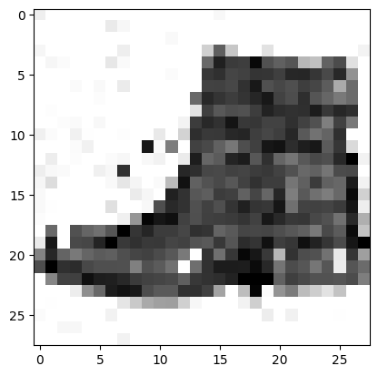
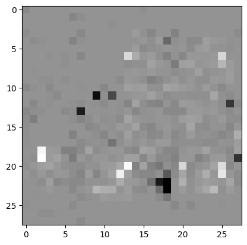

# Counterfactual explanations

A counterfactual explanation of a prediction describes the smallest change to the feature values that changes the prediction to a predefined output.  
This tool gives you the following benefits:  
1. Helps in understanding how, sometimes very sophisticated, model works
2. Presents how far we are from different output
3. It can assess the stability of model predictions and detect potential dangers  

Here I present some example of this concept on the Fashion-MNIST dataset.

## Loading necessary libraries


```python
import tensorflow as tf
import numpy as np
import matplotlib.pyplot as plt
from tensorflow.keras.datasets import fashion_mnist
from tensorflow.keras.utils import to_categorical
from alibi.explainers import Counterfactual

import warnings
warnings.filterwarnings('ignore')

```


```python
tf.compat.v1.disable_eager_execution() # for alibi compatibility
```

## Loading data


```python
(train_images, train_labels), (test_images, test_labels) = fashion_mnist.load_data()

train_images = train_images.astype("float32") / 255.0
test_images = test_images.astype("float32") / 255.0

train_labels = to_categorical(train_labels)
test_labels = to_categorical(test_labels)
```


```python
names_mapping = {
    0: "T-shirt/top",
    1: "Trouser",
    2: "Pullover",
    3: "Dress",
    4: "Coat",
    5: "Sandal",
    6: "Shirt",
    7: "Sneaker",
    8: "Bag",
    9: "Ankle boot"
}
```


```python
subset = np.random.choice(np.arange(6000), size=16)
plt.figure(figsize=(10,10))
for i in range(16):
    plt.subplot(4,4,i+1)
    plt.xticks([])
    plt.yticks([])
    plt.grid(False)
    label = np.where(train_labels[subset][i] == 1)[0][0]
    plt.imshow(train_images[subset][i], cmap=plt.cm.binary)
    plt.title(names_mapping[label])
plt.show()
```


    

    


## Simple network


```python
model = tf.keras.Sequential([
    tf.keras.layers.Flatten(input_shape=(28, 28)),
    tf.keras.layers.Dense(64, activation="relu"),
    tf.keras.layers.Dense(64, activation="relu"),
    tf.keras.layers.Dropout(0.5),
    tf.keras.layers.Dense(10, activation="softmax")
])
```


```python
loss = tf.keras.losses.CategoricalCrossentropy()
model.compile(optimizer="SGD", loss=loss, metrics=["accuracy"])
```


```python
model.fit(train_images, train_labels, batch_size=128, epochs= 200)
```


```python
eval = model.evaluate(test_images, test_labels, verbose=2)
print(f"Test results:\n loss: {eval[0]} accuracy: {eval[1]}")
```

    Test results:
     loss: 0.3391598818600178 accuracy: 0.8841999769210815
    

## Getting counterfactual explanation


```python
ex = np.random.randint(0, 6000)
X = test_images[ex].reshape((1,) + test_images[ex].shape)
plt.imshow(X.reshape(28, 28), cmap=plt.cm.binary)

label = np.where(test_labels[ex] == 1)[0][0]
name = names_mapping[label]
plt.title(name)

plt.show()
```


    

    


```python
shape = (1,) + train_images.shape[1:]
target_proba = 1.0
tol = 0.01
target_class = "other"
max_iter = 1000
lam_init = 1e-1
max_lam_steps = 10
learning_rate_init = 0.1
feature_range = (train_images.min(), train_images.max())
```


```python
cf = Counterfactual(model, shape=shape, target_proba=target_proba, tol=tol,
                    target_class=target_class, max_iter=max_iter, lam_init=lam_init,
                    max_lam_steps=max_lam_steps, learning_rate_init=learning_rate_init,
                    feature_range=feature_range)

explanation = cf.explain(X)
```


```python
pred_class = explanation.cf['class']
proba = round(explanation.cf['proba'][0][pred_class], 4)

print(f"Counterfactual prediction: {names_mapping[pred_class]} with probability {proba}")
plt.imshow(explanation.cf['X'].reshape(28, 28), cmap=plt.cm.binary)
plt.show()
```

    Counterfactual prediction: Sneaker with probability 0.9936000108718872
    


    

    


Now I can show which and how pixels has changed


```python
plt.imshow((explanation.cf['X']- X).reshape(28, 28), cmap=plt.cm.binary)
plt.show()
```


    

    


These pictures show how unstable the network is, despite its high accuracy. The new input does not look like a sneaker at all. It seems that it's enough to add some random noise for model to fail. 
